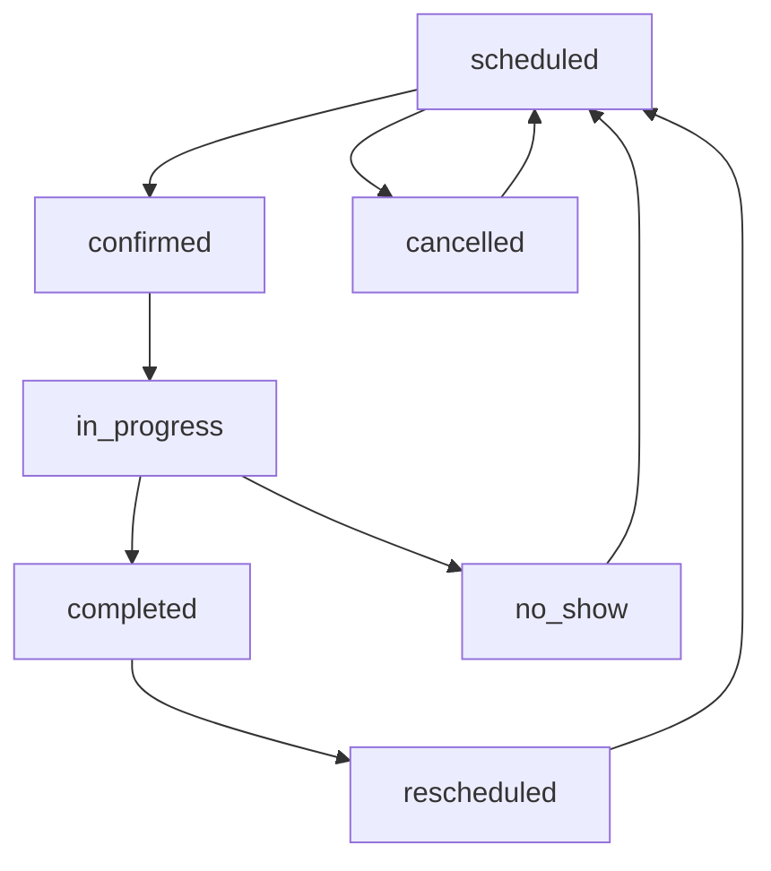
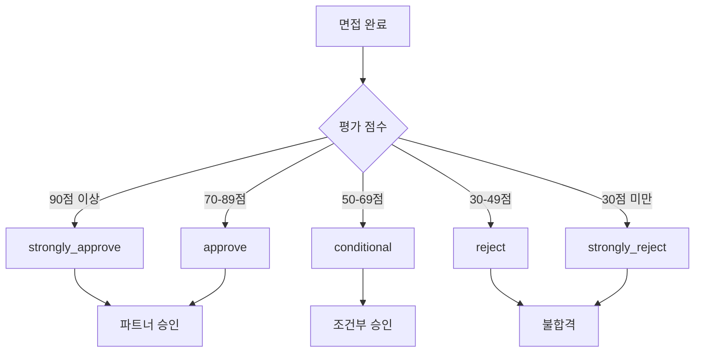

# 파트너 면접 관리 시스템

## 개요

파트너 면접 관리 시스템은 파트너 지원자의 면접 전 과정을 체계적으로 관리하는 시스템입니다. 
면접 예약부터 평가, 결과 처리까지의 전체 프로세스를 통합 관리하며, 대규모 지원자를 효율적으로 처리할 수 있도록 설계되었습니다.

## 🎯 핵심 기능

- **면접 일정 관리**: 예약, 변경, 취소 등 전체 면접 스케줄 관리
- **다양한 면접 방식**: 화상, 전화, 대면, 온라인 테스트 지원
- **면접관 배정**: 메인/백업 면접관 배정 및 관리
- **상세 평가 시스템**: 7개 영역 다면 평가 및 정량적 점수
- **실시간 진행 관리**: 면접 상태별 진행도 추적
- **추천 파트너 연계**: 추천인 정보 및 커미션 추적
- **대용량 처리**: 샤딩 환경 지원으로 확장성 확보

## 📊 테이블 구조

### 1. partner_interviews (메인 면접 관리)

면접의 기본 정보와 진행 상황을 관리하는 메인 테이블입니다.

#### 주요 필드

| 필드 | 타입 | 설명 | 예시 |
|------|------|------|------|
| `interview_status` | enum | 면접 상태 | 'scheduled', 'in_progress', 'completed' |
| `interview_type` | enum | 면접 방식 | 'video', 'phone', 'in_person', 'written' |
| `interview_round` | enum | 면접 차수 | 'first', 'second', 'final' |
| `scheduled_at` | datetime | 예정 시간 | '2024-11-15 14:00:00' |
| `interviewer_id` | bigint | 면접관 ID | 12345 |
| `technical_score` | decimal | 기술 점수 | 4.5 (1-5점) |
| `overall_score` | decimal | 종합 점수 | 4.2 (1-5점) |

#### 샤딩 지원 필드

```php
// 사용자 정보 샤딩
$table->unsignedBigInteger('user_id');
$table->string('user_uuid', 36)->nullable();
$table->unsignedTinyInteger('shard_number')->default(0);
$table->string('user_table', 50)->default('users');
```

### 2. partner_interview_evaluations (상세 평가)

면접의 상세한 평가와 피드백을 관리하는 테이블입니다.

#### 평가 영역 (1-100점)

| 영역 | 설명 | 가중치 |
|------|------|--------|
| `technical_skills` | 기술 역량 및 전문성 | 25% |
| `communication` | 의사소통 능력 | 20% |
| `motivation` | 동기 및 열정 | 15% |
| `experience_relevance` | 경력 연관성 | 15% |
| `cultural_fit` | 조직 적합성 | 10% |
| `problem_solving` | 문제 해결 능력 | 10% |
| `leadership_potential` | 리더십 잠재력 | 5% |

#### 피드백 구조 (JSON)

```json
{
  "strengths": [
    "뛰어난 기술적 이해도",
    "명확한 의사소통",
    "풍부한 실무 경험"
  ],
  "weaknesses": [
    "팀워크 경험 부족",
    "새로운 기술에 대한 학습 의지"
  ],
  "concerns": [
    "장기근무 의지 불분명",
    "스트레스 관리 능력"
  ],
  "action_items": [
    "팀 프로젝트 경험 축적 필요",
    "기술 블로그 작성 시작",
    "온라인 강의 수강 계획 수립"
  ]
}
```

## 🔄 면접 프로세스 플로우

### 1. 면접 상태 관리



#### 상태별 설명

- **scheduled**: 면접 일정이 예약됨
- **confirmed**: 지원자가 참석 확인
- **in_progress**: 면접이 진행 중
- **completed**: 면접 완료
- **cancelled**: 일정 취소
- **no_show**: 지원자 불참
- **rescheduled**: 일정 변경

### 2. 면접 결과 처리



## 🎥 면접 방식별 특징

### 1. 화상 면접 (video)

```php
// 화상 면접 설정
$interview = [
    'interview_type' => 'video',
    'meeting_url' => 'https://zoom.us/j/123456789',
    'meeting_password' => 'abc123',
    'preparation_notes' => '카메라와 마이크 테스트 필요'
];
```

**특징**:
- 가장 일반적인 면접 방식
- 실시간 화상 소통
- 화면 공유 가능
- 녹화 기능 지원

### 2. 전화 면접 (phone)

```php
// 전화 면접 설정
$interview = [
    'interview_type' => 'phone',
    'meeting_location' => '+82-10-1234-5678',
    'preparation_notes' => '조용한 환경에서 통화'
];
```

**특징**:
- 빠른 스크리닝용
- 지역 제약 없음
- 기본적인 소통 능력 평가

### 3. 대면 면접 (in_person)

```php
// 대면 면접 설정
$interview = [
    'interview_type' => 'in_person',
    'meeting_location' => '서울시 강남구 테헤란로 123, 5층 회의실A',
    'preparation_notes' => '신분증 지참, 주차 가능'
];
```

**특징**:
- 최종 면접에 주로 사용
- 직접적인 인상 평가
- 사무실 환경 소개 가능

### 4. 서면 면접 (written)

```php
// 서면 면접 설정
$interview = [
    'interview_type' => 'written',
    'meeting_url' => 'https://forms.company.com/interview/123',
    'preparation_notes' => '2시간 제한, 중간 저장 가능'
];
```

**특징**:
- 기술적 역량 평가
- 시간 제한 문제 해결
- 대량 스크리닝에 효율적

## 📈 평가 시스템 활용

### 1. 종합 점수 계산

```php
// 가중 평균 계산
$overallScore = (
    $evaluation->technical_skills * 0.25 +
    $evaluation->communication * 0.20 +
    $evaluation->motivation * 0.15 +
    $evaluation->experience_relevance * 0.15 +
    $evaluation->cultural_fit * 0.10 +
    $evaluation->problem_solving * 0.10 +
    $evaluation->leadership_potential * 0.05
);
```

### 2. 추천 등급 결정

```php
function getRecommendation($overallScore) {
    if ($overallScore >= 90) return 'strongly_approve';
    if ($overallScore >= 70) return 'approve';
    if ($overallScore >= 50) return 'conditional';
    if ($overallScore >= 30) return 'reject';
    return 'strongly_reject';
}
```

### 3. 피드백 구조화

```php
// 평가 피드백 저장
$feedback = [
    'strengths' => [
        '기술적 깊이가 뛰어남',
        '명확하고 논리적인 설명',
        '적극적인 질문과 학습 의지'
    ],
    'weaknesses' => [
        '팀 리더십 경험 부족',
        '신기술 적응에 시간 소요'
    ],
    'concerns' => [
        '업무 강도에 대한 적응 우려',
        '장기적 커밋먼트 확신 부족'
    ],
    'action_items' => [
        '팀 프로젝트 멘토링 참여',
        '기술 블로그 작성 시작',
        '온라인 강의 수강 계획 수립'
    ]
];
```

## 🔧 관리 기능

### 1. 면접 일정 관리

```php
// 면접 예약
InterviewController::schedule([
    'application_id' => 123,
    'interview_type' => 'video',
    'scheduled_at' => '2024-11-15 14:00:00',
    'interviewer_id' => 456
]);

// 일정 변경
InterviewController::reschedule($interviewId, [
    'scheduled_at' => '2024-11-16 10:00:00',
    'reason' => '면접관 일정 충돌'
]);
```

### 2. 면접관 배정

```php
// 메인 면접관 배정
$interview->assignInterviewer($interviewerId);

// 백업 면접관 설정
$interview->setBackupInterviewer($backupInterviewerId);

// 면접관 변경
$interview->changeInterviewer($newInterviewerId, $reason);
```

### 3. 알림 시스템

```php
// 면접 리마인더
NotificationService::sendInterviewReminder($interview, '1hour');

// 결과 알림
NotificationService::sendResultNotification($interview, $result);

// 일정 변경 알림
NotificationService::sendScheduleChange($interview, $changes);
```

## 📊 통계 및 리포팅

### 1. 면접 성과 지표

```sql
-- 면접관별 평가 통계
SELECT
    interviewer_id,
    interviewer_name,
    COUNT(*) as total_interviews,
    AVG(overall_score) as avg_score,
    COUNT(CASE WHEN interview_result = 'pass' THEN 1 END) as pass_count
FROM partner_interviews
WHERE interview_status = 'completed'
GROUP BY interviewer_id, interviewer_name;
```

### 2. 추천 파트너 성과

```sql
-- 추천 파트너별 면접 현황
SELECT
    referrer_partner_id,
    referrer_name,
    COUNT(*) as referred_interviews,
    AVG(overall_score) as avg_candidate_score,
    COUNT(CASE WHEN interview_result = 'pass' THEN 1 END) as success_count
FROM partner_interviews
WHERE referrer_partner_id IS NOT NULL
GROUP BY referrer_partner_id, referrer_name;
```

### 3. 면접 유형별 분석

```sql
-- 면접 방식별 성과 분석
SELECT
    interview_type,
    COUNT(*) as total_count,
    AVG(overall_score) as avg_score,
    AVG(duration_minutes) as avg_duration,
    COUNT(CASE WHEN interview_result = 'pass' THEN 1 END) / COUNT(*) * 100 as pass_rate
FROM partner_interviews
WHERE interview_status = 'completed'
GROUP BY interview_type;
```

## 🔍 인덱스 및 성능 최적화

### 1. 주요 인덱스

```sql
-- partner_interviews 테이블
INDEX idx_user_shard (user_id, shard_number)
INDEX idx_application (application_id)
INDEX idx_status_schedule (interview_status, scheduled_at)
INDEX idx_interviewer (interviewer_id)
INDEX idx_referrer (referrer_partner_id)

-- partner_interview_evaluations 테이블
INDEX idx_app_date (application_id, interview_date)
INDEX idx_interviewer_date (interviewer_uuid, interview_date)
INDEX idx_recommendation (recommendation, overall_rating)
```

### 2. 쿼리 최적화

```php
// 효율적인 면접 목록 조회
$interviews = Interview::with(['application.user', 'interviewer'])
    ->where('interview_status', 'scheduled')
    ->whereBetween('scheduled_at', [$startDate, $endDate])
    ->orderBy('scheduled_at')
    ->get();

// 페이징된 평가 목록
$evaluations = Evaluation::select(['id', 'application_id', 'overall_rating', 'recommendation'])
    ->with('application:id,user_name')
    ->orderBy('interview_date', 'desc')
    ->paginate(20);
```

### 3. 캐싱 전략

```php
// 면접관별 통계 캐싱
Cache::remember("interviewer_stats_{$interviewerId}", 3600, function() use ($interviewerId) {
    return InterviewStats::getInterviewerStats($interviewerId);
});

// 일별 면접 스케줄 캐싱
Cache::remember("daily_schedule_{$date}", 1800, function() use ($date) {
    return Interview::getDailySchedule($date);
});
```

## 🚀 향후 개선 계획

### 1. 단기 계획 (1-3개월)

- [ ] 화상 면접 자동 녹화 기능
- [ ] AI 기반 면접 분석 도구
- [ ] 모바일 앱 면접 일정 관리
- [ ] 실시간 면접 진행 대시보드

### 2. 중기 계획 (3-6개월)

- [ ] 음성 인식 기반 면접 요약
- [ ] 비디오 분석을 통한 감정 분석
- [ ] 자동화된 평가 보고서 생성
- [ ] 면접 품질 모니터링 시스템

### 3. 장기 계획 (6개월 이상)

- [ ] 머신러닝 기반 후보자 매칭
- [ ] 가상현실(VR) 면접 환경
- [ ] 블록체인 기반 면접 기록 보안
- [ ] 글로벌 시간대 자동 관리

## 📚 관련 문서

- [파트너 지원 시스템](./partner_application.md)
- [파트너 승인 프로세스](./partner_approval.md)
- [알림 관리 시스템](./partner_notifications.md)
- [사용자 관리](./partner_users.md)

---

*마지막 업데이트: 2024-11-15*
*문서 버전: 1.0*
