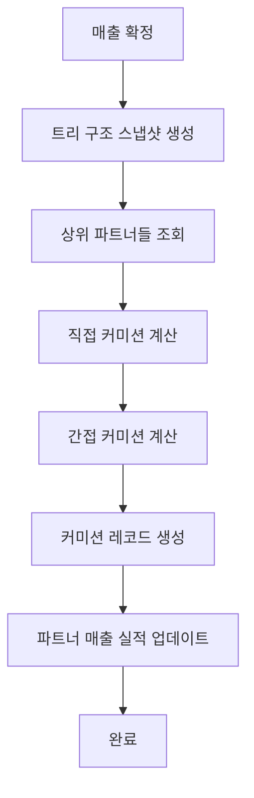

# 파트너 매출 관리 시스템

## 🎯 개요

파트너 매출 관리 시스템은 **MLM(다단계 마케팅) 네트워크**에서 각 파트너의 매출 성과를 관리하고 추적하는 핵심 모듈입니다. 매출 등록부터 커미션 분배까지 전 과정을 자동화하여 투명하고 효율적인 매출 관리를 제공합니다.

---

## 🚀 핵심 기능

### 1. **매출 등록 및 관리**
- ✅ **다양한 매출 유형 지원**: 서비스, 제품, 컨설팅, 교육 등
- ✅ **매출 상태 관리**: 대기(pending) → 확정(confirmed) → 완료 워크플로우
- ✅ **자동 주문번호 생성**: `PS-YYYYMMDD-0001` 형식
- ✅ **매출 승인 프로세스**: 관리자 승인 필요 시 별도 워크플로우

### 2. **파트너별 매출 추적**
- 📊 **개인 매출 통계**: `monthly_sales`, `total_sales` 실시간 동기화
- 📊 **팀 매출 관리**: `team_sales`로 하위 파트너 매출 합산 추적
- 📊 **성과 분석**: 카테고리별, 기간별, 채널별 매출 분석
- 📊 **동기화 검증**: 실제 매출 데이터와 파트너 정보 일치성 확인

### 3. **커미션 자동 계산**
- 🧮 **직접 커미션**: 매출을 올린 파트너 본인 커미션 (등급별 차등)
- 🧮 **간접 커미션**: 상위 파트너들 관리 보너스 (계층별 차등)
- 🧮 **자동 분배**: 매출 확정 시 관련 파트너들에게 즉시 분배
- 🧮 **역계산 지원**: 매출 취소 시 커미션 자동 회수

### 4. **실시간 동기화**
- 🔄 **매출 등록 시**: 파트너 `monthly_sales`, `total_sales` 자동 증가
- 🔄 **팀 매출 업데이트**: 상위 파트너들 `team_sales` 자동 증가
- 🔄 **매출 취소 시**: 모든 관련 수치 자동 차감 (역동기화)
- 🔄 **트랜잭션 보호**: 데이터 무결성 보장

---

## 📊 매출 데이터 구조

### **PartnerSales 테이블 주요 필드**

| 필드명 | 타입 | 설명 | 예시 |
|--------|------|------|------|
| `partner_id` | integer | 매출을 올린 파트너 ID | 3 |
| `partner_name` | string | 파트너 이름 (동기화) | "김영업" |
| `partner_email` | string | 파트너 이메일 (동기화) | "sales@company.com" |
| `title` | string | 매출 제목 | "웹사이트 개발 프로젝트" |
| `amount` | decimal(15,2) | 매출 금액 | 1000000.00 |
| `currency` | string | 통화 | "KRW" |
| `sales_date` | date | 매출 발생일 | "2025-11-05" |
| `order_number` | string | 주문번호 (자동생성) | "PS-20251105-0001" |
| `category` | string | 매출 카테고리 | "service", "product" |
| `product_type` | string | 제품/서비스 타입 | "consulting", "development" |
| `sales_channel` | string | 매출 채널 | "online", "offline", "referral" |
| `status` | enum | 매출 상태 | "pending", "confirmed", "cancelled" |
| `commission_calculated` | boolean | 커미션 계산 여부 | true/false |
| `total_commission_amount` | decimal(15,2) | 총 커미션 금액 | 50000.00 |
| `commission_recipients_count` | integer | 커미션 수령자 수 | 3 |
| `commission_distribution` | json | 커미션 분배 상세 | 계층별 분배 내역 |
| `tree_snapshot` | json | 트리 구조 스냅샷 | 매출 당시 조직도 |

### **매출 상태 (Status) 관리**

| 상태 | 설명 | 파트너 매출 반영 | 커미션 계산 |
|------|------|----------------|-------------|
| **pending** | 대기중 (승인 필요) | ❌ 반영 안됨 | ❌ 계산 안됨 |
| **confirmed** | 확정됨 | ✅ 즉시 반영 | ✅ 자동 계산 |
| **cancelled** | 취소됨 | ⚡ 자동 차감 | ⚡ 자동 회수 |
| **refunded** | 환불됨 | ⚡ 자동 차감 | ⚡ 자동 회수 |

---

## 🔧 파트너별 매출 관리 페이지

### **URL 형식**
```
http://localhost:8000/admin/partner/sales?partner_id=3
```

### **페이지 구성**

#### 1. **파트너 정보 카드**
```
┌─────────────────────────────────────────────────────────────┐
│ 📊 파트너 매출 관리 - 김영업님                                    │
├─────────────────────────────────────────────────────────────┤
│ 이름: 김영업 | 이메일: sales@company.com                        │
│ 등급: 골드 | 타입: 영업 파트너 | 레벨: 2                          │
│ 상위: 이부장 | 하위: 3명 | 경로: /1/2/3                         │
└─────────────────────────────────────────────────────────────┘
```

#### 2. **매출 통계 대시보드**
```
┌─────────────────┬─────────────────┬─────────────────┬─────────────────┐
│   이번 달 매출   │    총 누적 매출   │     팀 매출     │   커미션 수입    │
│   1,500,000원   │   15,000,000원  │   5,000,000원   │   300,000원     │
│      3건        │       45건      │      12건       │     2.5%       │
└─────────────────┴─────────────────┴─────────────────┴─────────────────┘
```

#### 3. **필터링된 통계** (현재 검색/필터 조건 기준)
- 총 매출액 및 건수
- 확정 매출 vs 대기 매출
- 평균 매출액
- 커미션 계산 현황

#### 4. **전체 기간 통계** (필터 무관)
- 첫 매출일 / 최근 매출일
- 최고 월 매출 기록
- 카테고리별 매출 분포
- 매출 채널별 분석

#### 5. **성과 지표 및 동기화 확인**
- `monthly_sales` vs 실제 계산값
- `total_sales` vs 실제 계산값
- 데이터 동기화 상태 표시

---

## 💰 커미션 계산 시스템

### **커미션 유형**

#### 1. **직접 커미션 (Direct Commission)**
- **대상**: 매출을 올린 파트너 본인
- **비율**: 파트너 등급별 차등 (브론즈 3% ~ 다이아몬드 8%)
- **계산**: `매출액 × 개인 커미션율`

#### 2. **간접 커미션 (Indirect Commission)**
- **대상**: 상위 파트너들 (최대 4단계)
- **비율**: 계층별 차등 적용
  - 1단계 상위: 3%
  - 2단계 상위: 2%
  - 3단계 상위: 1%
  - 4단계 상위: 0.5%
- **분배**: 하위 파트너 수에 따라 나눔

### **커미션 계산 프로세스**



### **자동 동기화 로직**

#### **매출 등록 시**:
```php
// 1. 매출을 올린 파트너 업데이트
$partner->increment('monthly_sales', $amount);
$partner->increment('total_sales', $amount);

// 2. 상위 파트너들 team_sales 업데이트
foreach ($ancestors as $ancestor) {
    $ancestor->increment('team_sales', $amount);
}

// 3. 커미션 자동 계산 및 분배
$commissionService->calculateAndDistribute($sales);
```

#### **매출 취소 시**:
```php
// 1. 커미션 역계산
$sales->reverseCommissionCalculation();

// 2. 파트너 매출 차감
$partner->decrement('monthly_sales', $amount);
$partner->decrement('total_sales', $amount);

// 3. 상위 파트너들 team_sales 차감
foreach ($ancestors as $ancestor) {
    $ancestor->decrement('team_sales', $amount);
}
```

---

## 🔍 매출 관리 기능

### **1. 매출 등록**
```php
POST /admin/partner/sales

{
    "partner_id": 3,
    "title": "웹사이트 개발 프로젝트",
    "amount": 1000000,
    "currency": "KRW",
    "sales_date": "2025-11-05",
    "category": "service",
    "product_type": "development",
    "status": "confirmed",
    "auto_calculate_commission": true
}
```

### **2. 매출 수정**
```php
PUT /admin/partner/sales/{id}

{
    "title": "수정된 프로젝트명",
    "amount": 1500000,
    "status": "confirmed"
}
```

### **3. 매출 취소**
```php
POST /admin/partner/sales/{id}/status/cancel

{
    "reason": "고객 요청에 의한 취소"
}
```

### **4. 매출 삭제**
```php
DELETE /admin/partner/sales/{id}
```
- 소프트 삭제로 기록 보존
- 커미션 계산된 경우 자동 역계산 수행
- 복원 기능 지원

---

## 📈 통계 및 분석

### **파트너별 매출 분석**
- **개인 성과**: 월별/연도별 매출 추이
- **팀 성과**: 하위 파트너 기여도 분석
- **카테고리 분석**: 어떤 서비스/제품이 잘 팔리는지
- **채널 분석**: 온라인/오프라인/추천 등 채널별 성과

### **시간대별 분석**
- **일별 매출**: 최근 30일간 매출 추이
- **월별 매출**: 월별 성과 비교
- **분기별 매출**: 계절성 분석
- **연도별 매출**: 장기 성장 추이

### **성과 지표**
- **평균 매출**: 건당 평균 매출액
- **매출 빈도**: 월평균 매출 건수
- **성장률**: 전월/전년 대비 성장률
- **목표 달성률**: 설정된 목표 대비 달성 정도

---

## 🛡️ 데이터 무결성 및 보안

### **트랜잭션 보호**
- 모든 매출/커미션 처리가 DB 트랜잭션으로 보호
- 실패 시 자동 롤백으로 일관성 보장
- 동시성 제어로 중복 처리 방지

### **감사 로그**
- 모든 매출 변경 이력 기록
- 누가, 언제, 무엇을, 왜 변경했는지 추적
- 커미션 계산 과정 상세 로그

### **권한 관리**
- **Admin 미들웨어**: 관리자만 접근 가능
- **파트너별 권한**: 본인 매출만 조회 가능
- **역할 기반 제어**: 매출 등록/수정/삭제 권한 분리

---

## 🔧 기술적 구현

### **SQLite/MySQL 호환성**
- 날짜 함수 동적 처리 (`strftime` vs `YEAR/MONTH`)
- DB 드라이버별 쿼리 최적화
- 크로스 플랫폼 지원

### **성능 최적화**
- **인덱싱**: partner_id, sales_date, status 복합 인덱스
- **페이징**: 대용량 데이터 효율적 처리
- **캐싱**: 통계 데이터 임시 저장
- **비동기 처리**: 커미션 계산 큐 시스템

### **확장성 설계**
- **모듈화**: 독립적인 매출 관리 모듈
- **이벤트 기반**: 매출 변경 시 자동 알림
- **API 지원**: 외부 시스템 연동 가능
- **다국화**: 다양한 통화 및 언어 지원

---

## 📊 사용 예시

### **시나리오 1: 신규 매출 등록**
1. 관리자가 파트너 매출 페이지 접속
2. "매출 등록" 버튼 클릭
3. 매출 정보 입력 (파트너, 금액, 카테고리 등)
4. "확정" 상태로 저장
5. **자동 실행**:
   - 파트너 `monthly_sales`, `total_sales` 증가
   - 상위 파트너들 `team_sales` 증가
   - 커미션 자동 계산 및 분배

### **시나리오 2: 매출 취소 처리**
1. 기존 매출 상세 페이지 접속
2. "취소" 버튼 클릭
3. 취소 사유 입력
4. **자동 실행**:
   - 커미션 역계산 (기존 커미션 회수)
   - 파트너 매출 수치 차감
   - 상위 파트너들 team_sales 차감
   - 상태를 'cancelled'로 변경

### **시나리오 3: 파트너별 성과 분석**
1. `?partner_id=3` 파라미터로 특정 파트너 페이지 접속
2. 파트너 정보 및 매출 통계 자동 표시
3. 필터 적용 (기간, 카테고리, 상태별)
4. 실시간 통계 업데이트
5. 엑셀 내보내기로 리포트 생성

---

## 🎯 모범 사례

### **매출 관리**
1. **정기적 검증**: 주간 단위로 파트너 매출 동기화 상태 확인
2. **투명한 공개**: 커미션 계산 과정을 파트너들에게 공개
3. **신속한 처리**: 매출 확정 후 24시간 이내 커미션 분배
4. **정확한 기록**: 모든 변경 사항에 대한 상세 사유 기록

### **성과 분석**
1. **목표 설정**: 파트너별 월간/분기별 매출 목표 설정
2. **정기 리뷰**: 월말 성과 분석 및 피드백 제공
3. **트렌드 분석**: 계절성, 시장 상황 등을 고려한 전략 수립
4. **인센티브 설계**: 우수 성과자에 대한 추가 보상 체계

---

## ❓ 자주 묻는 질문

### Q1: 매출이 등록되었는데 파트너 정보에 반영되지 않았어요.
**A**: 매출 상태가 'confirmed'인지 확인하세요. 'pending' 상태에서는 파트너 정보에 반영되지 않습니다.

### Q2: 커미션은 언제 계산되나요?
**A**: 매출이 'confirmed' 상태로 변경될 때 자동으로 계산됩니다. "자동 커미션 계산" 옵션을 활성화하면 즉시 분배됩니다.

### Q3: 매출을 취소하면 이미 지급된 커미션은 어떻게 되나요?
**A**: 자동으로 역계산되어 모든 관련 파트너의 커미션이 차감됩니다.

### Q4: team_sales는 어떻게 계산되나요?
**A**: 해당 파트너의 monthly_sales + 모든 하위 파트너들의 monthly_sales 합계입니다.

### Q5: 데이터 동기화 오류가 발생하면 어떻게 하나요?
**A**: 파트너 상세 페이지에서 "동기화 상태" 섹션을 확인하고, 차이가 발견되면 관리자에게 문의하세요.

---

**📌 이 문서는 파트너 매출 관리 시스템의 핵심 기능과 사용법을 담고 있습니다.**
**정기적인 업데이트를 통해 최신 정보를 유지하겠습니다.** 🚀